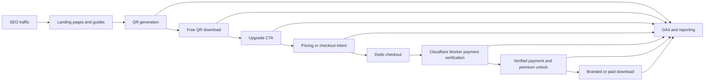

# GTM Engineering Case Study: From QR Utility to Measurable Revenue Funnel

> Publication status: implementation and deployment claims are tied to repository evidence. No conversion rate, revenue, traffic, uplift, or statistical result is claimed without a corresponding production report or screenshot.

This publication pass is documentation-only; it does not modify production application behavior.

## Recruiter Summary

**Role demonstrated:** GTM Engineer / Growth Engineer with product analytics and revenue-systems ownership.

**Systems used:** Static HTML and JavaScript, Next.js, GA4, Google Search Console reporting, Dodo Payments, Cloudflare Workers, GitHub Actions, and contract tests.

**Work demonstrated:** Designed an event taxonomy around real product states, hardened QR-generation error semantics, attributed upgrade intent across a multi-page funnel, verified payments server-side before revenue tracking, protected purchase events from refresh duplication, and placed CTAs at measurable value moments.

## Executive Overview

The product combines a free static vCard QR generator, a paid branded/logo QR workflow, a dynamic/editable QR application, and a bulk QR workflow. The GTM engineering problem was not simply adding more analytics calls. It was making each event represent a distinct business truth:

- a QR output really exists;
- a user downloaded the free or paid output;
- a visitor expressed upgrade intent;
- checkout actually started;
- payment was verified by Dodo;
- premium access was activated;
- paid value was delivered.

The implementation is documented in [`docs/analytics-events.md`](./analytics-events.md), with static-site and Next.js analytics helpers designed to no-op safely when analytics is blocked.

## Architecture

The same model applies to the dynamic/editable QR route, where the upgrade CTA hands the user to the SaaS application rather than the static logo checkout.

## Funnel Event Model

| Funnel stage | Canonical event | Business meaning |
|---|---|---|
| Product creation | `generated_qr_code` / `generated_branded_qr_code` | A settled QR output exists after the current generation state completes. |
| Free value realization | `download_qr` | The visitor downloaded the free output. |
| Dynamic intent | `clicked_dynamic_qr_cta` | The visitor clicked an editable/dynamic QR handoff. |
| Pricing intent | `clicked_pricing` | The visitor clicked a paid landing, pricing, upgrade, logo, or plan CTA. |
| Checkout intent | `pro_checkout_start` | A checkout session was successfully created. |
| Revenue conversion | `purchase` / `payment_success` | Payment success was confirmed by the verification path. |
| Premium activation | `pro_payment_success` | The paid browser flow was unlocked after verification. |
| Paid value realization | `pro_download_branded_qr` | The user downloaded the branded output after paid activation. |
| Unrecovered friction | `error_qr_generation` | A real generation/rendering failure remained after recovery logic. |

`clicked_pricing`, `pro_checkout_start`, and `pro_download_branded_qr` are intentionally not treated as equivalent to revenue. The first two represent intent; the last represents fulfillment after payment. `purchase` is the recommended GA4 revenue event.

## Verified Before/After Results

This table reports implementation changes, not business-performance metrics. “Verified” means the behavior is supported by committed code, tests, documentation, or deployment records listed in the evidence column.

| Area | Before | After | Verification basis |
|---|---|---|---|
| QR generation tracking | Page views, form activity, or generation attempts did not clearly express that a settled static or branded QR output existed. | `generated_qr_code` and `generated_branded_qr_code` fire after the relevant output settles, with QR type and output availability parameters. | [`index.html`](../index.html), [`logo-qr-code.html`](../logo-qr-code.html), [`qr-code-with-logo.html`](../qr-code-with-logo.html), [`tests/analytics-html-contract.test.cjs`](../tests/analytics-html-contract.test.cjs) |
| Error tracking | Async render timing and stale attempts could be confused with real QR-generation failures. | `error_qr_generation` is reserved for unrecovered failures and carries `qr_type`, `source_page`, `error_stage`, `error_message`, and `recovered: false`. | [`docs/analytics-events.md`](./analytics-events.md), generation guards in [`index.html`](../index.html) and branded pages, contract tests |
| Payment verification | A success-looking return URL or browser state was not sufficient proof of a completed payment. | `/payment/verify` asks the Cloudflare Worker to verify the payment with Dodo before premium unlock or revenue tracking. | [`workers/router.js`](../workers/router.js), [`success.html`](../success.html), [`docs/analytics-events.md`](./analytics-events.md) |
| CTA attribution | Dynamic, pricing, blog, bulk, logo, and dashboard CTAs had missing, weak, or legacy attribution. | `clicked_dynamic_qr_cta` is canonical; `clicked_pricing` carries CTA location, text, destination, source page, and logo intent where applicable. | [`index.html`](../index.html), [`bulk-qr-code.html`](../bulk-qr-code.html), [`dynamic-qr-guide.html`](../dynamic-qr-guide.html), [`blogs/index.html`](../blogs/index.html), blog templates, [`DashboardClient.tsx`](../vcard-qr-next/src/app/dashboard/DashboardClient.tsx) |
| Revenue-event integrity | Checkout intent and payment success could be conflated, and refreshes could risk duplicate revenue events. | `purchase` and `payment_success` follow verified payment; purchase tracking uses transaction-id idempotency. | [`analytics.js`](../analytics.js), [`vcard-qr-next/src/lib/analytics.ts`](../vcard-qr-next/src/lib/analytics.ts), [`success.html`](../success.html), [`tests/analytics-helper.test.cjs`](../tests/analytics-helper.test.cjs) |
| Value-moment CTA placement | The free journey had limited prompts after a user generated or downloaded a QR. | Dynamic, logo, branded-download, and team-editable prompts appear after generation, download, branded download, or bulk export. | `postGenerateCta` and `postDownloadCta` in [`index.html`](../index.html); `postBrandedDownloadCta` in logo pages; `postBulkExportCta` in [`bulk-qr-code.html`](../bulk-qr-code.html) |

## What Is Verified and What Is Not Claimed

The repository and deployment records support these claims:

- the event names and parameters are implemented in the static and SaaS code paths;
- generation success and error handling use settled-state and retry-aware logic;
- Dodo payment verification is performed through a Worker secret-backed path;
- purchase tracking includes transaction-id idempotency;
- the Day 4 CTA changes were committed to `main` and deployed through the Pages and Worker workflows;
- the documentation and contract tests describe the intended taxonomy.

This case study does not claim a conversion uplift, revenue increase, SEO improvement, or statistically significant experiment result. Those require a defined observation window and an attached production report.

## Evidence

The following image paths are publication placeholders. Add the screenshots only after removing personal data, payment identifiers, customer information, and unrelated browser context.

### SEO reporting

*Caption: The SEO report should prove the reporting workflow and date ranges used to select GTM priorities. It must not be presented as proof of revenue impact unless it includes a linked product-funnel report.*

Repository path: `docs/assets/gtm-case-study/seo-report.png`

### GA4 Realtime

*Caption: The GA4 Realtime screenshot should show a fresh static, branded, or CTA journey and the observed canonical event names. It proves event receipt for that test session, not a population-level conversion rate.*

Repository path: `docs/assets/gtm-case-study/ga4-realtime.png`

### Payment verification

*Caption: The payment-verification screenshot should show a sanitized successful verification response or deployment/log evidence that Dodo verification is reached. It must not expose API keys, payment secrets, customer data, or full transaction identifiers.*

Repository path: `docs/assets/gtm-case-study/payment-verification.png`

### CTA audit

*Caption: The CTA audit screenshot should show the page, visible copy, destination, event name, and attribution parameters for representative dynamic and pricing CTAs.*

Repository path: `docs/assets/gtm-case-study/cta-audit.png`

## Source and Deployment Evidence

- [Analytics taxonomy](./analytics-events.md)
- [Analytics contract tests](../tests/analytics-html-contract.test.cjs)
- [Analytics helper tests](../tests/analytics-helper.test.cjs)
- [Cloudflare Worker deployment workflow](../.github/workflows/deploy-workers.yml)
- [Day 4 CTA implementation commit](https://github.com/abhikb2005/vcard-qr-generator/commit/a5b0a80)
- [Pages deployment run for the Day 4 commit](https://github.com/abhikb2005/vcard-qr-generator/actions/runs/26831213243)
- [Worker deployment run for the Day 4 commit](https://github.com/abhikb2005/vcard-qr-generator/actions/runs/26831215283)
- [Repository commit history](https://github.com/abhikb2005/vcard-qr-generator/commits/main)
- [GitHub deployments](https://github.com/abhikb2005/vcard-qr-generator/deployments)
- [Live product](https://www.vcardqrcodegenerator.com/)

## GTM Engineering Takeaway

The core work was not adding isolated tracking calls. It was aligning product state, payment truth, CTA intent, and reporting vocabulary so that each step can be analyzed without overstating what it proves.

That creates a foundation for later GTM work:

- compare CTA copy and placement by page and journey stage;
- connect search landing pages to activated product behavior;
- distinguish pricing interest from verified revenue;
- measure paid value realization separately from payment;
- add conversion metrics only after a defined production observation window.
